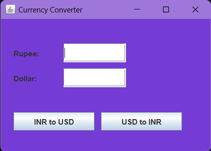

# Java Currency Converter

A simple currency converter built with Java Swing and AWT to convert between Indian Rupees (INR) and US Dollars (USD).

## Table of Contents

- [Overview](#overview)
- [Features](#features)
- [Installation](#installation)
- [Usage](#usage)
- [Screenshots](#screenshots)
- [Contributing](#contributing)
- [License](#license)

## Overview

This Java Currency Converter project is a small repository created for learning purposes, focusing on Java Swing and AWT for building graphical user interfaces. The application allows users to convert currency between INR and USD effortlessly.

## Features

- Convert INR to USD and vice versa.
- Simple and intuitive graphical user interface.
- Basic error handling for invalid input.

## Installation

To run the Java Currency Converter, follow these steps:

1. Make sure you have Java installed on your system.
2. Compile the `Main.java` file using the following command:
   ```bash
   javac Main.java
   ```
3. Run the compiled Java class:
   ```bash
   java Main
   ```

## Usage

1. Enter the amount in the "Rupee" text field.
2. Click "INR to USD" button to convert INR to USD.
3. Enter the amount in the "Dollar" text field.
4. Click "USD to INR" button to convert USD to INR.

## Screenshots



## Contributing

Contributions to this project are welcome! Feel free to fork the repository, make improvements, and submit pull requests. Follow these steps:

1. Fork the repository.
2. Create a branch: `git checkout -b feature/new-feature`.
3. Make your changes and commit them: `git commit -m 'Add new feature'`.
4. Push to the branch: `git push origin feature/new-feature`.
5. Submit a pull request.
